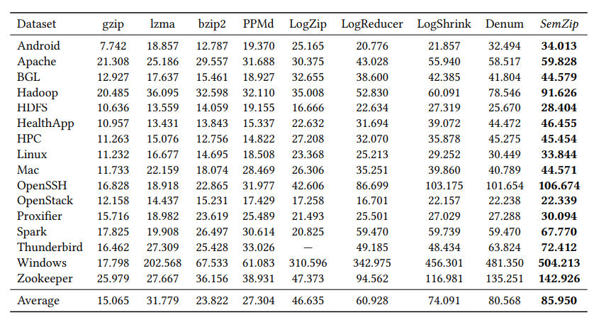
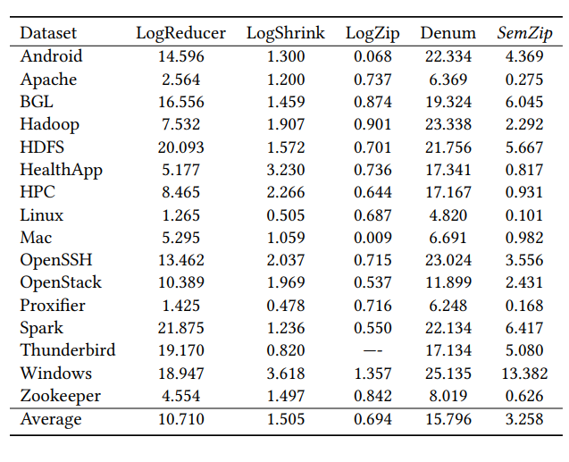
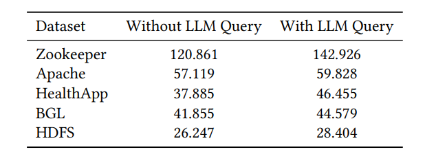
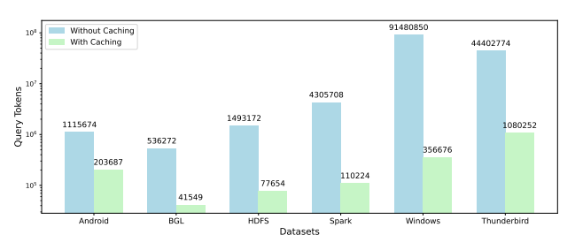
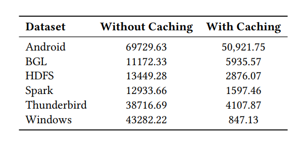

# SemZip

##### Dataset

Loghub: 

https://github.com/logpai/loghub

download these datasets and copy them into Logs/{logname}/{logname}.log

### Compress


##### Dependencies

python >= 3.7.3

regex = 2012.1.8

gcc >= 9.4.0

PCRE2 = 10.34

libboost-iostreams-dev = 1.71.0.0ubuntu2

In our environment with gcc, we used the following two commands to complete the configuration of the experimental environment: 

1. ` apt install libpcre2-dev` 2. `apt install libboost-iostreams-dev`

##### GPT model configuration
Find the following codes in SemZip.cpp and replace "YOURKEY" with your api key.
```cpp 
680 std::cerr << "Connecting to ChatGPT ... ..." << std::endl;
681 const std::string api_url = "https://api.b3n.fun/v1/chat/completions";
682 const std::string api_key = "YOURAPIKEY"; // Replace with your actual API key
683 const int max_retries = 1;
```

##### 1. Compile


`g++ -O3 -std=c++17 -I./utf8cpp/source -o SemZip SemZip.cpp -lboost_iostreams -lpthread -lpcre2-8 -lcurl`

#### 2. Execution

Assume the chunksize is set to 100000, and the target log file is Logs/HDFS/HDFS.log

`./SemZip HDFS 100000 1 4`

The last parameter is thread number.


### Decompress

Note that datasets using different tags may encounter errors during decompression. We have only designed the recovery of the 
IP address for Apache decompression. When applied to specific tags in specific datasets, users may need to mimic the function 
of line809 to design recovery functions. This is because although the IPaddress mode is<\*>.<\*>.<\*>.<\*>, The number represented 
by<\*>may be 1-3, so we will fill it with 0 and remove the high-order 0 during decompression. For example, the value of 1.1.1.1 
during compression is 001001001. Users need to pay attention to the changes in the number of numbers represented by<\*>in the tag

### Experimental Results Repreduction

Research questions:

• RQ1: What is the effectiveness of SemZip?

• RQ2: What is the efficiency of SemZip?

• RQ3: How does each module in SemZip contribute to its
performance?


#### 1. RQ1

1. Download these datasets and put them into Logs/{logname}/{logname}.log from [loghub](https://github.com/logpai/loghub)

2. Compile the code according to the previous instructions, and then run the following command: `./SemZip {logname} 100000 1 4`

3. Perform the above operations for different datasets. 

4. Record CR&CS

Results:


Since CR is unrelated to environment, we sourced the CRs of other compressors directly from the original
papers

results


#### 2. RQ2

The same steps as RQ1 to get CRs of SemZip

Reproduce [Denum](https://github.com/gaiusyu/Denum) [LogShrink](https://github.com/IntelligentDDS/LogShrink) and [LogReducer](https://github.com/THUBear-wjy/LogReducer) according their instructions.

Record CS

results





#### 3. RQ3

Find the following codes in SemZip.cpp and replace "YOURKEY" with wrong api key.
Then run SemZip on each datasets.

```cpp 
680 std::cerr << "Connecting to ChatGPT ... ..." << std::endl;
681 const std::string api_url = "https://api.b3n.fun/v1/chat/completions";
682 const std::string api_key = "YOURAPIKEY"; // Replace with your actual API key
683 const int max_retries = 1;
```

you will get results as following:



Query tokens of each batch will be printed in the window. 



Whether each batch queries the LLM will be printed in the window. Then you can calculate the average query tokens.


